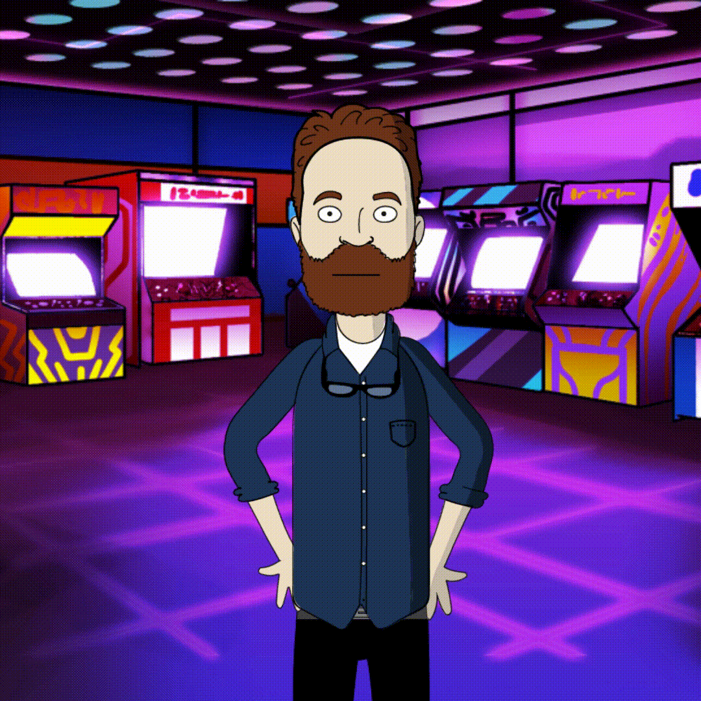

# 🎬 Moovi – AI Movie & Series Recommendation Agent  
Moovi is an **AI-powered recommendation agent** that suggests movies and series in an interactive way based on users mood, vibe and preferences.  

What makes Moovi different is its **AI-generated character** that interacts with users during their search journey, making recommendations more engaging and fun.  

This project was built to combine my knowledge of **frontend, backend, API integration, AI agents, and prompt engineering** into one complete application.  
<p align="center">
  
</p>

---

## ✨ Features  

- 🎭 **Interactive AI character** that reacts to user queries.  
- ⚡ **Modern frontend** built with React + Vite plus tailwind css for styling.  
- 🖥️ **Backend powered by Express.js** and a **FastAPI agent backend**.  
- 🧠 **SmolAgent (Hugging Face)** as the reasoning engine, guided by a carefully crafted system prompt.  
- 🎥 **OMDb API** integration for detailed movie/series data (title, runtime, posters, etc.).  
- 🔎 **DuckDuckGo Search** integration for fetching external suggestions.  
- 🧩 **Clean architecture** combining Fronted, Backend, and agent environement in one project.  

---

## 🛠️ Tech Stack  

### Frontend  
- [React](https://react.dev/) + [Vite](https://vitejs.dev/)  
- TailwindCSS (for modern, clean UI)  

### Backend  
- [Express.js](https://expressjs.com/) – REST API backend  
- [FastAPI](https://fastapi.tiangolo.com/) – Agent backend powered with SmolAgent  
- [SmolAgent](https://huggingface.co/docs/smolagents/index) – Agent framework for reasoning  
- OMDb API – Movie/Series metadata  
- DuckDuckGo Search – search engine  

### Others  
- Prompt Engineering (custom system prompt to guide the agent’s responses)  
- Ai Character creation using Adobe express and ElevenLabs 

---

## 🚀 Getting Started  

### 1. Clone the repository  
```bash
git clone https://github.com/your-username/moovi.git
cd moovi
```

### 2. Frontend (Client) Setup  
```bash
cd Client
npm install
npm run dev
```
Create a .env file in your Client project root with the following keys:
```bash
VITE_API_URL=http://localhost:3001
```

### 3. Backend (Server) Setup  
```bash
cd Server
npm install
node index.js
```
Create a .env file in your Server project root with the following keys:
```bash
PORT=3001
AGENT_API_URL=http://127.0.0.1:8000/agent
CLIENT_ORIGIN_URL=http://localhost:5173
```

### 4. Agent Backend Setup
```bash
# Create venv
python -m venv venv  

# Activate venv
# On Linux/Mac
source venv/bin/activate  

# On Windows
venv\Scripts\activate
```
```bash
cd agent-backend
pip install -r requirements.txt
python main.py
```
Create a .env file in your Agent project root with the following keys:
```bash
OMDB_API_KEY="your_omdb_api_key"
GEMINI_API_KEY="your_gemeni_api_key"
YOUTUBE_API_KEY="yout_youtube_api_key"
ORIGINS="http://localhost,http://localhost:3001"
```
## 🔮 Future Improvements

- Enhance the AI character’s animations and interactions and make it dynamic dpendent on the user query.

- Add support for streaming platform availability.

- Improve recommendation accuracy with more data sources, tools, and more powerful system prompt.

## 🤝 Contributing

Contributions are welcome! Feel free to fork this repo, open issues, and submit pull requests.
